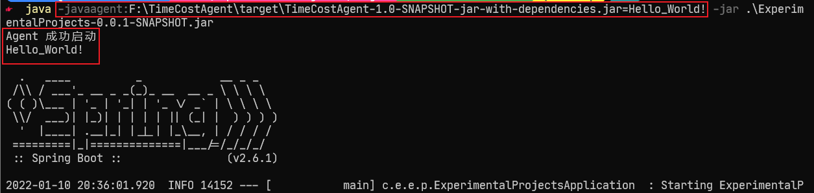
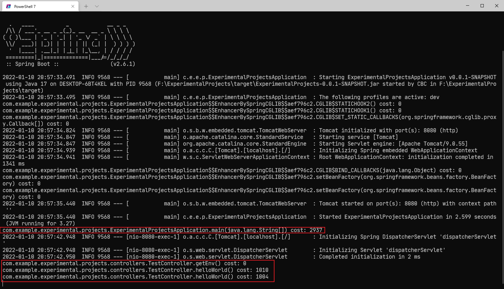
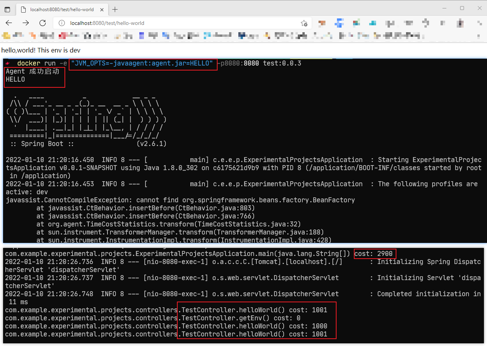

# Java agent 集成

对上一篇文档进行 Java Agent 方面的测试，也顺便补充一点 Java Agent 方面的知识。

## 准备 Agent 项目

最简单的 Java Agent 只需要如下代码即可：

```Java
public class TimeCostAgent {

    /**
     * jvm 参数形式启动，运行此方法
     *
     * @param agentArgs
     * @param inst
     */
    public static void premain(String agentArgs, Instrumentation inst) {
        System.out.println("Agent 成功启动");
        System.out.println(agentArgs);
    }

    /**
     * 动态 attach 方式启动，运行此方法
     *
     * @param agentArgs
     * @param inst
     */
    public static void agentmain(String agentArgs, Instrumentation inst) {
        System.out.println("Agent 成功启动");
        System.out.println(agentArgs);
    }
}
```

配置好 POM.xml 和 MANIFEST.MF(或者不需要该文件完全通过 POM.xml 来完成配置也是可行的，此处略)

```XML
<?xml version="1.0" encoding="UTF-8"?>
<project xmlns="http://maven.apache.org/POM/4.0.0"
         xmlns:xsi="http://www.w3.org/2001/XMLSchema-instance"
         xsi:schemaLocation="http://maven.apache.org/POM/4.0.0 http://maven.apache.org/xsd/maven-4.0.0.xsd">
    <modelVersion>4.0.0</modelVersion>

    <groupId>org.agent</groupId>
    <artifactId>TimeCostAgent</artifactId>
    <version>1.0-SNAPSHOT</version>

    <properties>
        <maven.compiler.source>8</maven.compiler.source>
        <maven.compiler.target>8</maven.compiler.target>
    </properties>

    <build>
        <plugins>
            <plugin>
                <groupId>org.apache.maven.plugins</groupId>
                <artifactId>maven-assembly-plugin</artifactId>
                <version>3.3.0</version>
                <configuration>
                    <descriptorRefs>
                        <descriptorRef>jar-with-dependencies</descriptorRef>
                    </descriptorRefs>
                    <archive>
                        <manifestFile>
                            src/main/resources/META-INF/MANIFEST.MF
                        </manifestFile>
                    </archive>
                </configuration>
                <executions>
                    <execution>
                        <id>make-assembly</id>
                        <phase>package</phase>
                        <goals>
                            <goal>single</goal>
                        </goals>
                    </execution>
                </executions>
            </plugin>
        </plugins>
    </build>

</project>
```

```PlainText
Manifest-Version: 1.0
Can-Redefine-Classes: true
Can-Retransform-Classes: true
Premain-Class: org.agent.TimeCostAgent
Agent-Class: org.agent.TimeCostAgent

```

将项目打成 jar 包即可。

## Java agent 使用

启动时带相应参数 `-javaagent:{agent.jar 路径}` 即可实现 agent 注入。

上述 agent 使用方式及结果如下图：



作为测试用到这 agent 就可以了，但是也是顺便学习一下 Java agent ，打算简单实(C)现(V)一个检测方法执行时间的 agent。具体实现方法略，效果如下：



~~虽然其实并没有完全理解实现原理但是总之实现了一个具体的功能比单纯的 hello world 更方便后面测试了~~

## 镜像打包及运行

为了能够正常使用 agent 需要将其 jar 包打包进容器。为此 Dockerfile 加了一(两)句：

```Dockerfile
ARG AGENT_FILE=src/main/resources/*.jar
COPY ${AGENT_FILE} agent.jar
```

然后正常打包，运行容器即可。`-javaagent`指令可以在 Dockerfile 写死也可以通过环境变量传进容器，这里采用了后者（因为比较灵活）。效果如下：


