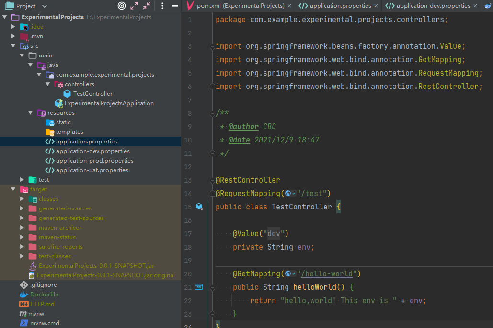
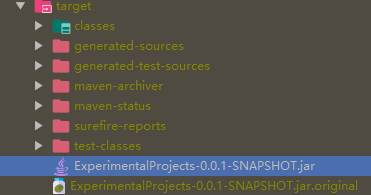
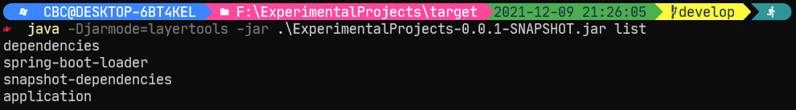
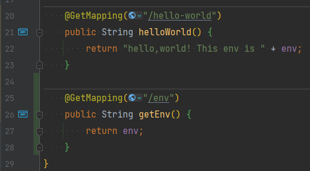
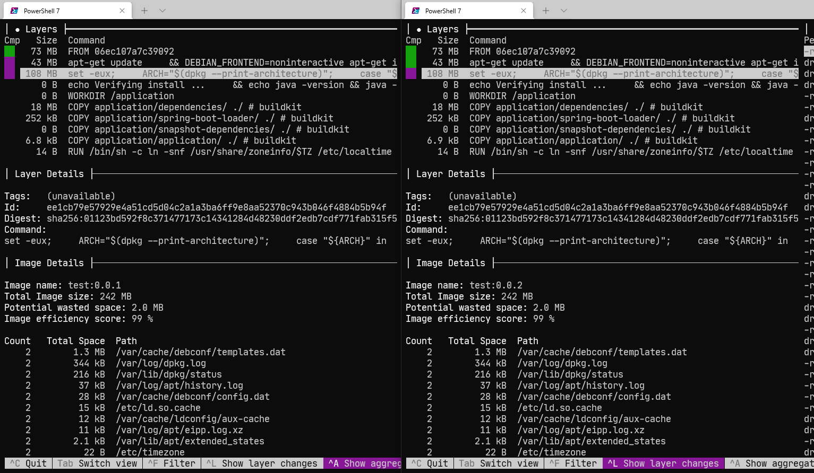
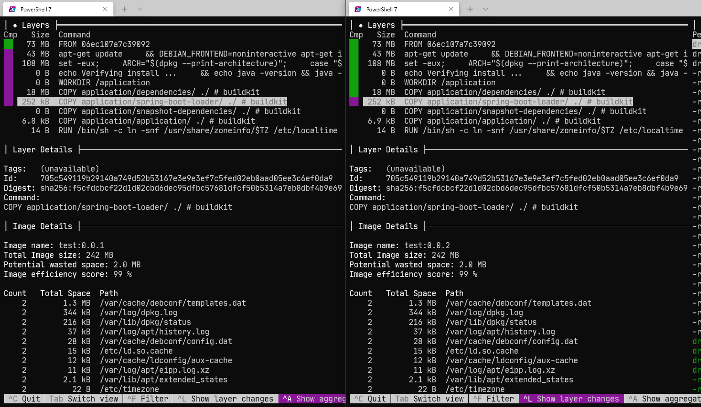
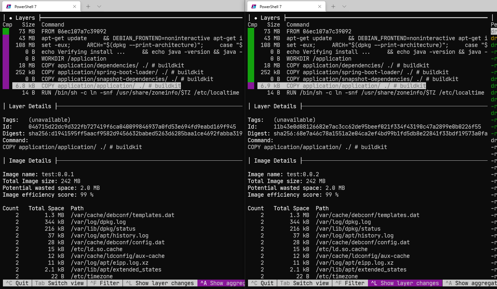

# 分层打包镜像

## 1. 准备 spring boot 项目

简单，略过
spring boot 版本 > 2.3.x 即可
简单写了一个 hello world


## 2. 进行相关配置

这里网上很多 blog 都强调了要去 pom.xml 里手动配置启用分层打包：

```xml
<build>
    <plugins>
        <plugin>
            <groupId>org.springframework.boot</groupId>
            <artifactId>spring-boot-maven-plugin</artifactId>
            <configuration>
                <!--开启分层编译支持-->
                <layers>
                    <enabled>true</enabled>
                </layers>
            </configuration>
        </plugin>
    </plugins>
</build>

```

2.3.x 版本的时候因为是新功能需要手动配置开启。但是**目前 spring boot 版本（使用版本 2.6.1）实测不需要手动配置，默认支持该特性。**（根据一些 blog 的说法是 2.4.x 版本之后就默认开启了）
目前的[官方文档](https://docs.spring.io/spring-boot/docs/2.6.0/maven-plugin/reference/htmlsingle/#packaging.layers)（2.6.0 版本）的说法也是默认支持，反而不需要该特性时才需要手动配置：

> The repackaged archive includes the `layers.idx` file by default. To disable this feature, you can do so in the following manner:
>
> ```XML
> <project>
>    <build>
>        <plugins>
>            <plugin>
>                <groupId>org.springframework.boot</groupId>
>                <artifactId>spring-boot-maven-plugin</artifactId>
>                <configuration>
>                    <layers>
>                        <enabled>false</enabled>
>                    </layers>
>                </configuration>
>            </plugin>
>        </plugins>
>    </build>
> </project>
> ```

## 3. package

执行 `mvn package` 进行打包，得到 jar 包文件。

其实实际上本质是使用了 spring-boot-maven 插件的 repackage，得到了完整的包含依赖的 jar 包和原始的 jar 包（自动添加后缀 .original）
打开 jar 包，会发现在 BOOT-INF 文件夹下有 `classpath.idx` 和 `layers.idx` 文件，打开看下：

- classpath.idx

```
- "BOOT-INF/lib/logback-classic-1.2.7.jar"
- "BOOT-INF/lib/logback-core-1.2.7.jar"
- "BOOT-INF/lib/log4j-to-slf4j-2.14.1.jar"
- "BOOT-INF/lib/log4j-api-2.14.1.jar"
- "BOOT-INF/lib/jul-to-slf4j-1.7.32.jar"
- "BOOT-INF/lib/jakarta.annotation-api-1.3.5.jar"
- "BOOT-INF/lib/snakeyaml-1.29.jar"
- "BOOT-INF/lib/jackson-databind-2.13.0.jar"
- "BOOT-INF/lib/jackson-annotations-2.13.0.jar"
- "BOOT-INF/lib/jackson-core-2.13.0.jar"
- "BOOT-INF/lib/jackson-datatype-jdk8-2.13.0.jar"
- "BOOT-INF/lib/jackson-datatype-jsr310-2.13.0.jar"
- "BOOT-INF/lib/jackson-module-parameter-names-2.13.0.jar"
- "BOOT-INF/lib/tomcat-embed-core-9.0.55.jar"
- "BOOT-INF/lib/tomcat-embed-el-9.0.55.jar"
- "BOOT-INF/lib/tomcat-embed-websocket-9.0.55.jar"
- "BOOT-INF/lib/spring-web-5.3.13.jar"
- "BOOT-INF/lib/spring-beans-5.3.13.jar"
- "BOOT-INF/lib/spring-webmvc-5.3.13.jar"
- "BOOT-INF/lib/spring-aop-5.3.13.jar"
- "BOOT-INF/lib/spring-context-5.3.13.jar"
- "BOOT-INF/lib/spring-expression-5.3.13.jar"
- "BOOT-INF/lib/spring-boot-2.6.1.jar"
- "BOOT-INF/lib/spring-boot-autoconfigure-2.6.1.jar"
- "BOOT-INF/lib/slf4j-api-1.7.32.jar"
- "BOOT-INF/lib/spring-core-5.3.13.jar"
- "BOOT-INF/lib/spring-jcl-5.3.13.jar"
- "BOOT-INF/lib/spring-boot-jarmode-layertools-2.6.1.jar"
```

- layers.idx

```
- "dependencies":
  - "BOOT-INF/lib/"
- "spring-boot-loader":
  - "org/"
- "snapshot-dependencies":
- "application":
  - "BOOT-INF/classes/"
  - "BOOT-INF/classpath.idx"
  - "BOOT-INF/layers.idx"
  - "META-INF/"
```

再验证一下：

分层信息 ok

## 4. Dockerfile

Dockerfile 文件也相对常规，只是在打包镜像之前使用 jarmode 命令把 jar 包解压了，然后在打包镜像过程中将不同层依次 COPY，将改动可能性最大的应用层放在最后，这样前面的没有变化就可以直接使用 Docker 的缓存以提高打包效率。

```Dockerfile
FROM eclipse-temurin:8-jre-focal as builder
WORKDIR application
ARG JAR_FILE=target/*.jar
COPY ${JAR_FILE} application.jar
RUN java -Djarmode=layertools -jar application.jar extract

FROM eclipse-temurin:8-jre-focal
WORKDIR application
COPY --from=builder application/dependencies/ ./
COPY --from=builder application/spring-boot-loader/ ./
COPY --from=builder application/snapshot-dependencies/ ./
COPY --from=builder application/application/ ./
ENV TZ="Asia/Shanghai"
RUN ln -snf /usr/share/zoneinfo/$TZ /etc/localtime && echo $TZ > /etc/timezone
ENV JVM_OPTS=""
ENV JAVA_OPTS=""
ENTRYPOINT ["sh","-c","java $JVM_OPTS $JAVA_OPTS org.springframework.boot.loader.JarLauncher"]
```

## 5. 应用程序修改&dive 分析

其实如果只打包一次镜像是没有体现分层的优势的，所以需要修改部分内容后再打包一次（或者多次，但是本质是一样的所以这里只修改了一次）
修改部分应用代码：

重新打 jar 包&重新打镜像，这样得到了两个镜像：

使用 dive 对两个镜像进行分析：



可以发现：直到发生改变的应用层（application/application/）之前，两边的分层的 Id、Digest 都是完全一致的，所以这些层是可以复用的，相同的层只会在 docker 的目录下存储单个，如此可以大大减少容器编译、推送的时长。
（具体 docker 镜像的分层的了解还有限，后续再进一步了解）
